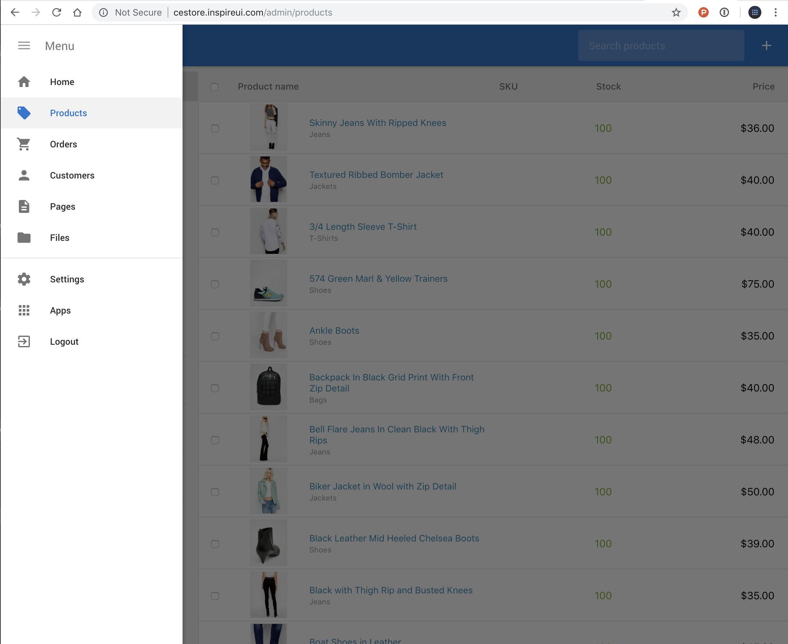
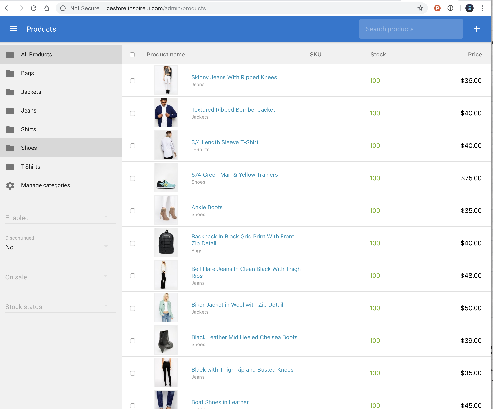
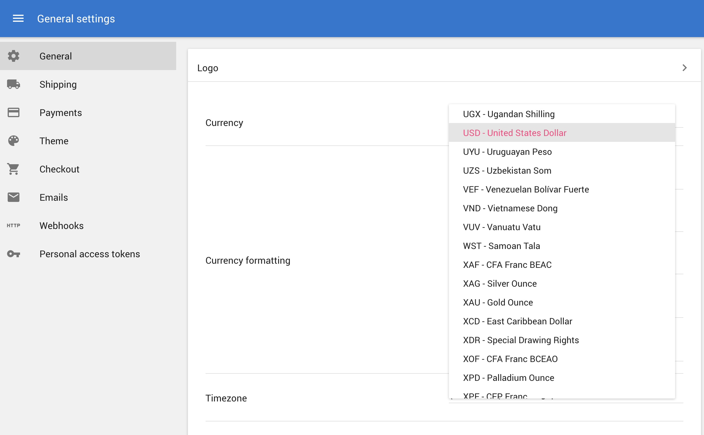

## 1. NPM Scripts

You can use following script for set up the product, the common use is **yarn start** and **yarn build**

| `npm run <script>`   | Description                                                  |
| -------------------- | ------------------------------------------------------------ |
| `clean:admin`        | Delete admin asset bundles.                                  |
| `clean:store`        | Delete store asset bundles.                                  |
| `compile:dev`        | Compiles the application to disk **and watch** (`~/dist` by default). |
| `compile`            | Compiles the application to disk (`~/dist` by default).      |
| `webpack:admin:dev`  | Assemble admin bundles **and watch**.                        |
| `webpack:store:dev`  | Assemble store bundles **and watch**.                        |
| `webpack:admin:prod` | Assemble admin bundles.                                      |
| `webpack:store:prod` | Assemble store bundles.                                      |
| `theme:install`      | Install theme from /public/.zip                              |
| `theme:export`       | Zip current theme to /public/.zip                            |
| `theme:copy`         | Compile theme and copy assets to /public/                    |
| `theme:build:dev`    | Refresh theme after modification **and watch**.              |
| `theme:build:prod`   | Refresh theme after modification.                            |
| `build:dev`          | Compile and assemble bundles **and watch**.                  |
| `build`              | Compile and assemble bundles.                                |
| `start`              | Start node server.                                           |

## 2. Manage the Product

After successful setup on step 1 then you can able to login to the admin dashboard to manage the products, select **Product** menu form the right side bar

The Click the + button on correct top-right to create new product

## 3. General Settings

Go to Left menu side, select Setting and update the detail config from the side menu, example change teh default Currency from the General setting:

