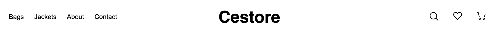
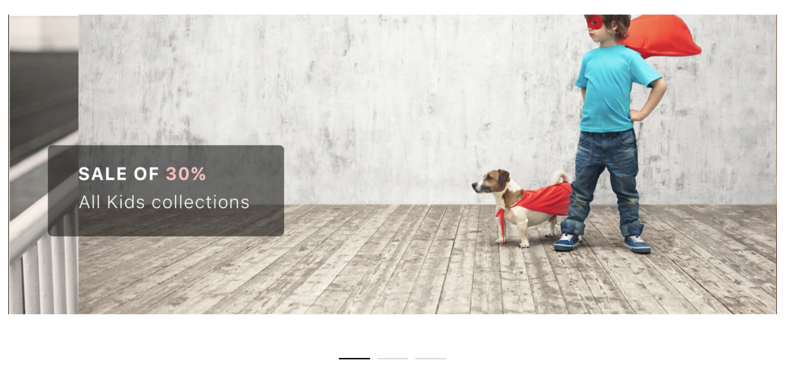
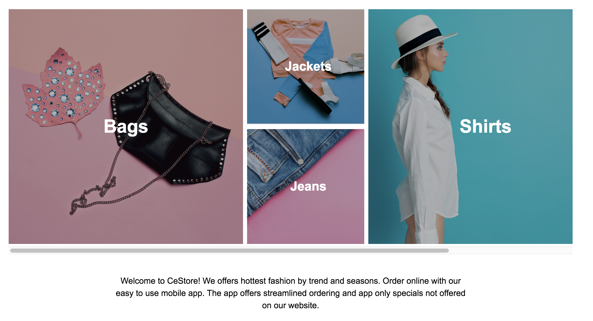
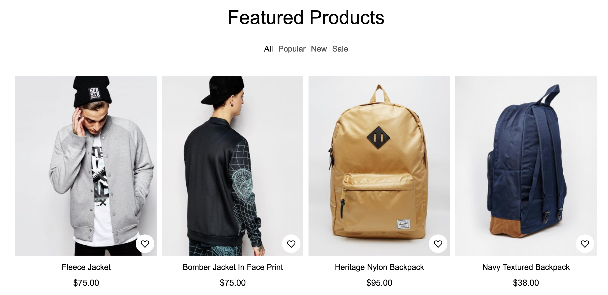
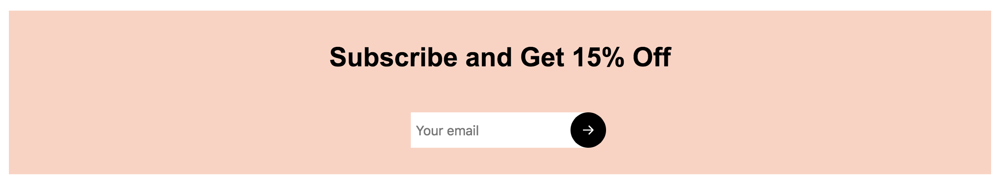
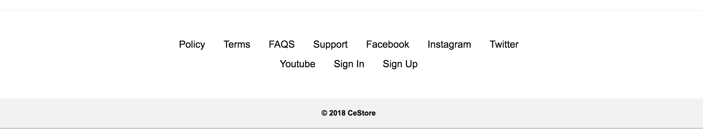

## Header menu

###### Description

- The component view for header menu
- File locate: theme/src/components/header/index.js
- Screenshot:



###### Code Snippets

```
export default class Header extends React.Component {
  state = {
    showSearch: false,
    searchText:''
  }

  render() {
    const {categories, cart, settings, currentPage, location, productFilter} = this.props.state;
    var items = []
    categories.some((item,index)=>{
      items.push(<li key={index}><NavLink to={item.path}>{item.name}</NavLink></li>)
      return index == 1
    })

    let {showSearch,searchText} = this.state

    return (
      <header>
        <div className="container header">
          <nav>
            <ul>
              {items}
              <li><a href="https://inspireui.com">About</a></li>
              <li><NavLink to="/contact">Contact</NavLink></li>
            </ul>
          </nav>
          <NavLink id="name" to="/">
            <h1>Cestore</h1>
          </NavLink>
          <div className="right-menu">
            <div className="search-wrap">
              <div className="search-content">
                <div className="input-wrap">
                  <input type="text" value={searchText} onChange={this.handleChange} aria-label="search"/>
                </div>
                <div className={`overlay ${showSearch ? "hide-overlay" : ""}`}></div>
              </div>
            </div>
            <ul>
              <li>
                <div className="search-icon">
                  
                  
                </div>
              </li>
              <li><NavLink to="/favorite"></NavLink></li>
              <li id="cart">
                <NavLink to="/cart"></NavLink>
                <CartCount cart={cart}/>
              </li>
            </ul>
          </div>
        </div>
      </header>
    )
  }

  onSearch = ()=>{
    let {showSearch} = this.state
    this.setState({showSearch: !showSearch})
    if (showSearch) {
      this.setState({searchText:''})
      this.props.setLocation("/")
    }
  }

  handleChange = (event) => {
    let searchText = event.target.value
    this.setState({searchText});
    this.handleSearch(searchText)
  }

  handleSearch = (search) => {
    if (this.props.state.currentPage.path === '/search') {
      this.props.setSearch(search)
    } else if (search && search !== '') {
      this.props.setLocation(`/search?search=${search}`)
    }
  }
}
```


## Banner slider

###### Description

- Mange the the view the slider of homepage

- File locate: theme/src/components/homeSlider.js

- You can able to manage the slider via Admin side: http://localhost:3000/admin/settings/theme

- Screenshot:

  

###### Code Snippets

```
const HomeSlider = ({ images }) => {
  if (images && images.length > 0) {
    const items = images.map(item => ({
      original: '/assets/images/' + item.image,
      title: item.title,
      description: item.description,
      path: item.path || '',
      button: item.button,
    }))

    return (
      <section className="section" style={{ padding: 0 }}>
        <div className="container">
          <div className="home-slider">
            <ImageGallery
              items={items}
              lazyLoad={true}
              showThumbnails={false}
              slideInterval={2000}
              showNav={themeSettings.home_gallery_shownav === true}
              showBullets={images.length > 1}
              showPlayButton={false}
              showFullscreenButton={false}
              slideOnThumbnailHover={false}
              renderItem={renderItem}
            />
          </div>
        </div>
      </section>
    )
  } else {
    return null;
  }
}

export default HomeSlider;
```


## Category Section

###### Description

- The component view to show the product category info

- File locate: theme/src/components/categories.js

- Setting Admin URL: http://localhost:3000/admin/products/categories

- Screenshot: 

  

###### Code Snippets

```
class Categories extends React.Component {
  render() {
    let {categories} = this.props
    var list = []
    var large = true
    var items = []
    categories.forEach((item)=>{
        if (large) {
          items.push(
            <NavLink to={item.path} aria-label={item.name}>
              <div className="large-item" style={{'background-image': "url("+item.image+")"}}>
                <div className="foreground" />
                <h2>{item.name}</h2>
                
              </div>
            </NavLink>
          )
          large = false
        }else{
          list.push(item)
          if (list.length == 2) {
            items.push(
              <div className="item-wrap">
                {list.map((item)=>(
                  <NavLink to={item.path} aria-label={item.name}>
                    <div className="item" style={{'background-image': "url("+item.image+")"}}>
                      <div className="foreground" />
                      <h2>{item.name}</h2>
                      
                    </div>
                  </NavLink>
                ))}
              </div>
            )
            large = true
            list = []
          }
        }
    })

    if (list.length > 0) {
      items.push(
        <div className="item-wrap">
          {list.map((item)=>(
            <div className="item" style={{'background-image': "url("+item.image+")"}}>
              <div className="foreground" />
              <h2>{item.name}</h2>
              <NavLink to={item.path}></NavLink>
            </div>
          ))}
        </div>
      )
    }
    return (
      <section id="categories">
          <div className="container">
            <div className="categories-wrap">
              {items}
            </div>
            <p className="description">Welcome to CeStore! We offers hottest fashion by trend and seasons. Order online with our easy to use mobile app. The app offers streamlined ordering and app only specials not offered on our website.</p>
          </div>
      </section>
    )
  }
}

export default Categories;
```

### 

## Feature products

###### Description

- Mange the view to show the features products
- File locate: theme/src/containers/index.js
- Screenshot:
  

###### Code Snippets

```
<section id="featured-products">
    <div className="container">
      <h2>Featured Products</h2>
      <nav className="tab">
        <ul>
          <li>
            {selectedTab == "all" && <a className= "active" onClick={()=>this.setState({selectedTab: 'all'})}>All</a>}
            {selectedTab != "all" && <a onClick={()=>this.setState({selectedTab: 'all'})}>All</a>}
          </li>
          <li>
            {selectedTab == "popular" && <a className="active" onClick={()=>this.setState({selectedTab: 'popular'})}>Popular</a>}
            {selectedTab != "popular" && <a onClick={()=>this.setState({selectedTab: 'popular'})}>Popular</a>}
          </li>
          <li>
            {selectedTab == "new" && <a className="active" onClick={()=>this.setState({selectedTab: 'new'})}>New</a>}
            {selectedTab != "new" && <a onClick={()=>this.setState({selectedTab: 'new'})}>New</a>}
          </li>
          <li>
            {selectedTab == "sale" && <a className="active" onClick={()=>this.setState({selectedTab: 'sale'})}>Sale</a>}
            {selectedTab != "sale" && <a onClick={()=>this.setState({selectedTab: 'sale'})}>Sale</a>}
          </li>
        </ul>
      </nav>

      {selectedTab === 'all' && (
        <CustomProducts
          sku={themeSettings.home_products_sku}
          sort={themeSettings.home_products_sort}
          limit={themeSettings.home_products_limit}
          settings={settings}
        />
      )}

      {selectedTab === 'popular' && (
        <CustomProducts
          sort="stock_status,price,position"
          limit={themeSettings.home_products_limit}
          settings={settings}
        />
      )}
      {selectedTab === 'new' && (
        <CustomProducts
          sort="-date_created"
          limit={themeSettings.home_products_limit}
          settings={settings}
        />
      )}
      {selectedTab === 'sale' && (
        <CustomProducts
          sort="-date_created"
          on_sale
          limit={themeSettings.home_products_limit}
          settings={settings}
        />
      )}
    </div>
</section>
```

### 

## Subscriber

###### Description

- Manage the subscribe features

- File locate: theme/src/containers/subscribe.js

- Screenshoot:

  

###### Code Snippets

```
export default class Subscribe extends React.PureComponent {
  render() {
    const { settings } = this.props;

    return (
      <section id="subscribe">
          <div className="container">
            <h2>Subscribe and Get 15% Off</h2>
            <form>
                <input type="text" placeholder="Your email" aria-label="email"/>
                <a></a>
            </form>
          </div>
      </section>
    )
  }
}
```

### 

## Footer

###### Description

- File locate: theme/src/containers/footer.js
- If you are using the default footer from Cezerin, the menu items can be managed from the admin / Setting / Theme
- Screenshot:
  

###### Code Snippets

```
export default class Footer extends React.PureComponent {
  render() {
    const { settings } = this.props;

    return (
      <footer>
        <nav>
          <ul>
            <li><a href="#">Policy</a></li>
            <li><a href="#">Terms</a></li>
            <li><NavLink to="/faq">FAQS</NavLink></li>
            <li><a href="#">Support</a></li>
            <li><a href="#">Facebook</a></li>
            <li><a href="#">Instagram</a></li>
            <li><a href="#">Twitter</a></li>
            <li><a href="#">Youtube</a></li>
            <li><a onClick={this.props.onSignIn}>Sign In</a></li>
            <li><a onClick={this.props.onSignUp}>Sign Up</a></li>
          </ul>
        </nav>
          <div className="copyright">
            © 2018 CeStore
          </div>
      </footer>
    )
  }
}
```

### 

