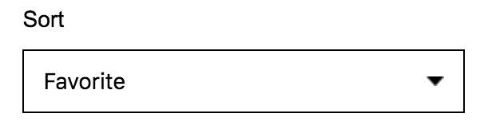
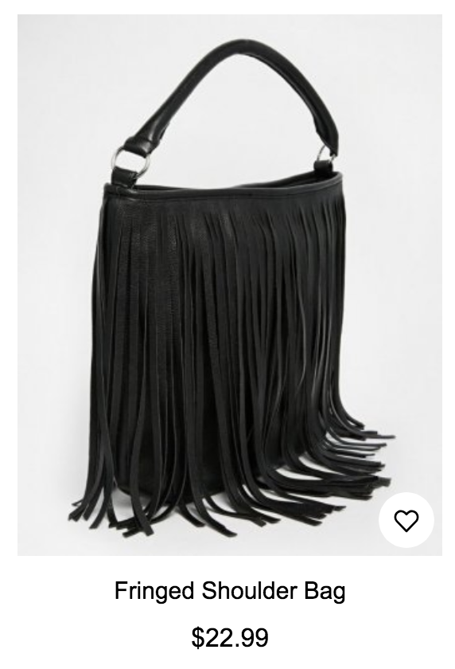

## Category Banner

###### Components

- File locate: theme/src/containers/category.js and theme/src/components/headBox.js

###### Code Snippets

```
<HeadBox title={categoryDetails.name} backgroundColor="#87B9B2"/>
```
```
export default class HeadBox extends React.PureComponent {
  render() {
    const { title, backgroundColor } = this.props;

    return (
      <section>
        <div className="container head-box" style={{"backgroundColor":backgroundColor}}>
            <h1>{title}</h1>
        </div>
      </section>
    )
  }
}
```
###### Screenshots


## Category Sorting

###### Components

- File locate: theme/src/components/sort.js

###### Code Snippets

```
const Sort = ({ defaultSort, currentSort, setSort }) => {
  return (
    <div className="filter-item">
      <h4>Sort</h4>
      <div className="dropdown">
        <select onChange={e => {setSort(e.target.value)}} value={currentSort} aria-label="sort">
        <option value={defaultSort}>{text.sortFavorite}</option>
        <option value={themeSettings.sortNewest}>{text.sortNewest}</option>
        <option value={themeSettings.sortPriceLow}>{text.sortPriceLow}</option>
        <option value={themeSettings.sortPriceHigh}>{text.sortPriceHigh}</option>
        </select>
      </div>
    </div>
  )
}

export default Sort
```

###### Screenshots



## Product Card View

###### Components

- File locate: theme/src/components/productList/item.js

###### Code Snippets

```
<div className="item">
  <div className="img-wrap">
    <NavLink to={product.path}><ItemImage images={product.images} productName={product.name} height={placeholderHeight} /></NavLink>
    <a onClick={this.likeProduct} className="btn-favorite"></a>
  </div>
  <NavLink to={product.path}><h4>{product.name}</h4></NavLink>
  <ItemPrice product={product} settings={settings} />
</div>
```

###### Screenshots

